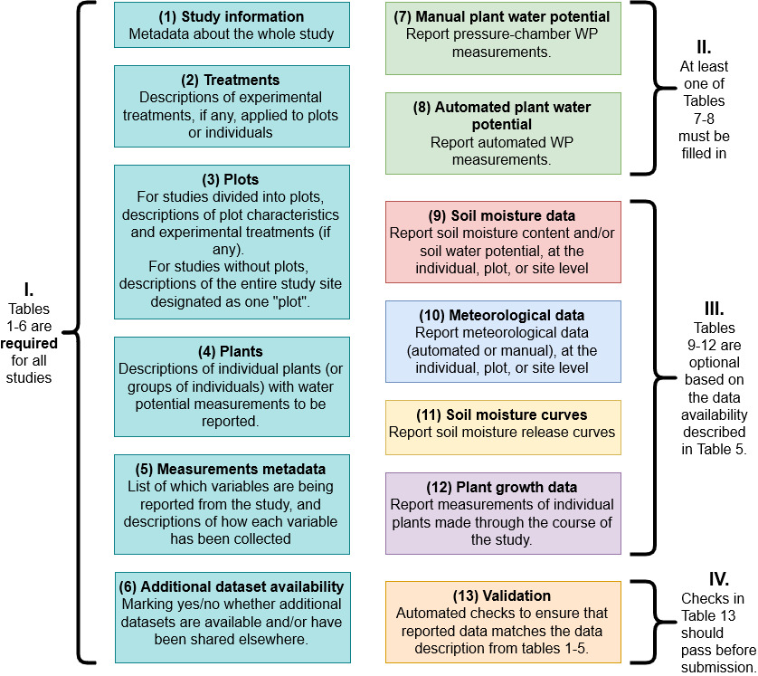

\newpage

# Accessing and setting up the template

## Google Sheets (preferred)

The data entry template is available as a View-only Google Sheet here: <https://docs.google.com/spreadsheets/d/1tbePuzJnCmVSI1n4J1yVnqH2MedqRT35vxUPtHzw3u8/edit#gid=1167393800>

To enter your data, please *make a copy* of this Google Sheet using File > Make a copy. Name your copy of the sheet something informative. _RMD note: A specific format here may be helpful, but "shouldn't" matter as we will be extracting values programmatically from the Google Sheets, and the identifying information is also present in the table itself._

Enter your data by working through this document. When you are done, please submit your data using the form *here*. _RMD note: Update this to a survey form that takes the Google Sheet URL and includes instructions for updating sharing permissions so we can access it._

## Microsoft Excel (less preferred)

_Not implemented yet, but once we have a stable version of the template in GSheets we can create an Excel analog without too much trouble and post a link to it here._

\newpage

# Overview of tables

# Instructions for entering data

## T1: Study information

Enter a single row of data with information about your study.

If you are submitting data for multiple sites, please fill in separate templates for each.

## T2: Treatments

This table describes the experimental treatments (if any) applied at either the "plot" or "individual" level. For example, your study might involve rainout shelters or fertilizer applications to some plots but not other. Or, you may have conducted a greenhouse experiment where some _individuals_ received water additions or had experimentally manipulated phenotypes.

1. If your study does *not* contain experimental treatments (i.e. all measurements are under "ambient" or "control" conditions), set `Level of Treatment` to "Entire Study" and set the `Treatment ID` to "No treatment".
2. If the study contains experimental treatments at the level of plots (or transects, or stands):
    1. Set `Level of Treatment to "Stand/plot/transect".
    2. For all non-control treatments, enter a Treatment ID (short code for how the treatment is referred to elsewhere in the data) and a Treatment Description describing the treatment.
    3. For example, “LOW_WATER” for Treatment ID and a description of a rainfall manipulation experiment for Treatment Description.
3. If the study contains experimental treatments at the level of individuals (e.g. individuals grown in a greenhouse under separate conditions, or genotype experiments):
    1. Select Level of Treatment = Individual
    2. For all non-control treatments, enter a Treatment ID (short code for how the treatment is referred to elsewhere in the data) and a Treatment Description describing the treatment.
    3. For example, “PHENO_1” for Treatment ID and a description of a phenotype manipulation experiment for Treatment Description.

## T3: Stand/plot/transect

For studies divided into plots (or stands, transects, or any other unit or organization between "Whole study" and individual plants), this table describes those, including abiotic conditions and experimental treatments (if any). 

If your study does not contain meaningful plots (e.g. measurements in a single greenhouse bay or a single stand of trees), describe the entire study site as a single "plot".

1. If the study does not have any “plot” structure (for example, all measurements are taken from a single “plot”, or the study is a greenhouse experiment with a single room, or treatments are imposed only at the individual level):
   1. Set the Plot_ID to "Whole site"
   2. Set Treatment_ID to “No treatment"
   3. Enter the remaining data for the study site (as applicable).
2. If the study is divided into plots:
    1. Enter one row for each plot
    1. Assign a unique Plot ID to each plot.
    1. Select the appropriate experimental treatment ID. Treatment IDs must come from the treatments described in the Treatmetns table (2).
    2. Enter the remaining data fields as applicable. 

## T4: Plants (individuals)

This table describes the individual plants (or, if measurements are pooled among multiple individuals of the same species, groups of individuals) for which water potential will be reported.

1. If water potential measurements reported correspond to specific individuals:
         1. Assign each individual an Individual_ID and set the “Number_of_individuals” to 1.
2. If water potential measurements reported derive from pools of multiple individuals (of the same species, in the same plot):
         1. Assign each pool an Individual_ID and set the “Number of individuals” to the number of individuals in the pool.
3. If the study is organized into plots (see the Plots table):
        1. Specify which plot each individual or pool of individuals comes from. If there are no meaningful plots, set all Plot_IDs to "Whole site".
        1. Plot IDs must come from the plots described in the Plots table.
4. If experimental treatments are assigned at the “Site” or “Plot” levels, assign the Plot Treatment ID corresponding to the treatments described in the Treatments Table.
5. If experimental treatments are assigned at the individual level, assign the Individual Treatment ID corresponding to the treatments described in the Treatments Table.
5. Enter the remaining columns as available/applicable.

## T5: Data descriptions

This table describes the data variables (plant water potential, and any additional related covariates) to be reported in the following tables.

At least one of Automated and/or Manual Plant Water Potential must be supplied (green rows). All other variables are optional. Rows are color coded according to which table each variable is reported in. Red rows are reported in the Soil Moisture tab; blue rows are reported in the Met data tab; purple rows are reported in the Plant Growth tab; and yellow rows are reported in the Soil Moisture Curves tab.

For each variable, please check whether or not it is available and indicate at what level of organization (whole study, plots, or individual plants/groups of plants) it is collected, and remaining columns describing how the data were collected. If your data are in units other than the ones specified in the template, please convert your data to the specified units before reporting. 

## T6: Additional datasets

This table describes any additional datasets that may complement the data you are uploading here, but are not being collected by PSInet. If these data are available, PSInet will flag their existence for users and direct users to the source to access these data.

## T7: Manual plant WP

This table is for reporting manual (pressure chamber) water potential data. 

_For these and subsequent tables, follow the instructions in the column headers._

## T8: Automated plant WP

## T9: Soil moisture data (timeseries)

## T10: Meteorological data

## T11: Plant growth data

## T12: Soil moisture curves

## T13: Submission validation

_This table is to-be-developed once we have a stable intake format. It will contain checks to validate that the data provided align with the data described in the Data Description table (table 5) and that all plot and treatment IDs are valid._

# Instructions for submitting data
